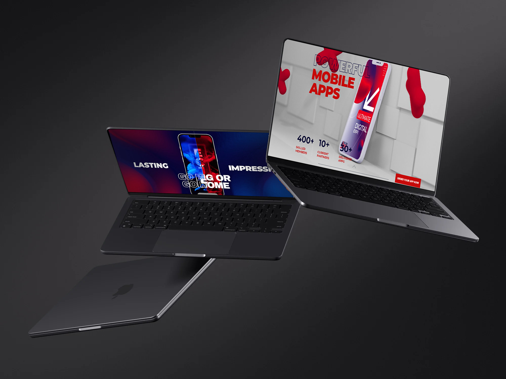

<p align="center">
    
</p>

# ECJE Website

ECJE (Enetcom Junior Entreprise) is a non-profit digital service-based organization. This project is dedicated to their new website, which incorporates an array of exciting features, including motion graphics, parallax scrolling, fluid transitioning sliders, and more.

## Preview


<details>
  <summary>Click to expand for more images</summary>

  
  
  
  
  
  
  
   
   
   
    
     
</details>

## Live Demo

🌐 Explore the live demo of the ECJE Website: [**Live Demo**](https://sami-souissi.github.io/ECJE_Website/)

Feel free to interact with the website and experience its features in action.

## Table of Contents

- [Overview](#overview)
- [Tech Stack](#tech-stack)
- [Features](#features)
- [Getting Started](#getting-started)
- [Contributing](#contributing)
- [License](#license)

## Overview

The ECJE Website serves as the digital gateway for Enetcom Junior Entreprise. It showcases their services, creative solutions, and commitment to delivering excellence in the digital world. With captivating motion graphics, parallax scrolling, and fluid transitioning sliders, this website promises an immersive user experience.

## Tech Stack

### Frontend:

- 
- 
- 
- 

### Hosting/Deployment:
- 

## Features

- **Motion Graphics:** Engage visitors with captivating motion graphics that breathe life into the website's content.

- **Parallax Scrolling:** Create depth and enhance the user experience with visually stunning parallax scrolling effects.

- **Fluid Transitioning Sliders:** Use fluid sliders for seamless content transitions, providing an intuitive browsing experience.

- **Interactive Elements:** Implement interactive elements to make navigation user-friendly and engaging.

## Getting Started

To get started with the ECJE Website, follow these steps:

1. Clone this repository to your local machine:
   ```bash
   git clone https://github.com/Sami-Souissi/ECJE_Website.git
   ```

2. Navigate to the project directory:
   ```bash
   cd ECJE_Website
   ```

3. Launch a local server for development and testing. You can use tools like Python's built-in HTTP server:
   ```bash
   python -m http.server
   ```

   For Python 2, use:
   ```bash
   python -m SimpleHTTPServer
   ```

4. Open your web browser and visit `http://localhost:8000` to explore the website locally.

5. Interact with the website to experience its features.

## Contributing

We welcome contributions to improve the ECJE Website. If you'd like to contribute, please follow these guidelines:

1. Fork the repository.
2. Create a new branch for your feature or fix.
3. Make your changes and commit them.
4. Push your changes to your fork.
5. Submit a pull request to the main repository.

## License

This project is licensed under the [MIT License](LICENSE.md). See the [LICENSE.md](LICENSE.md) file for details.
